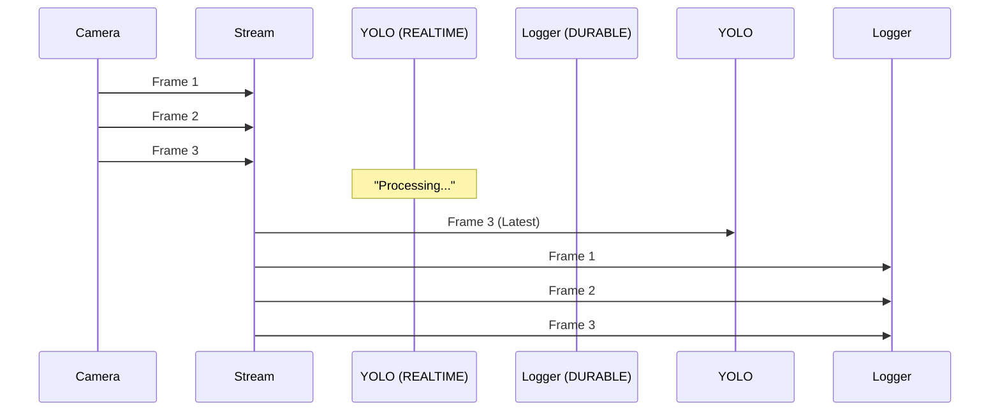
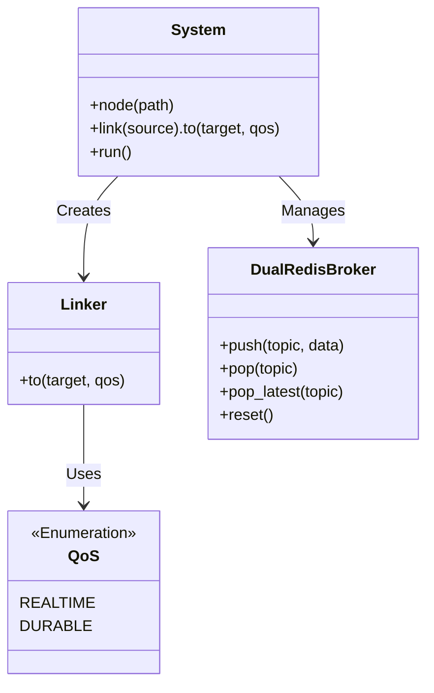

# EdgeFlow Architecture

## Overview
EdgeFlow is a lightweight, distributed framework for Edge AI pipelines, designed for high-performance video processing on resource-constrained devices.

## Core Concepts

### 1. Dual Control/Data Plane (DualRedisBroker)
To solve the "Redis Lag" problem in high-throughput video streams, we separate metadata from payload.

```mermaid
graph TD
    subgraph Edge Device
        PRODUCER[Producer Node\n(Camera)]
    end

    subgraph "Dual Broker"
        CTRL[Control Redis :6379\n(Stream: IDs)]
        DATA[Data Redis :6380\n(Blob: Images)]
    end

    subgraph Consumers
        AI[AI Node\n(QoS: REALTIME)]
        LOG[Logger Node\n(QoS: DURABLE)]
    end

    PRODUCER -- "1. Store Image (SET)" --> DATA
    PRODUCER -- "2. Push ID (XADD)" --> CTRL
    
    CTRL -- "3. Notify ID" --> AI
    CTRL -- "3. Notify ID" --> LOG
    
    AI -- "4. Fetch Image (GET)" --> DATA
    LOG -- "4. Fetch Image (GET)" --> DATA
```

### 2. QoS-based Consumption
We support different consumption patterns from a **Single Stream** to handle both real-time requirements and data integrity.



- **REALTIME (YOLO)**: Uses `pop_latest()`. Skips intermediate frames if processing is slow. Always guarantees lowest latency.
- **DURABLE (Logger)**: Uses `pop()`. Reads every single frame sequentially using Consumer Groups. Guarantees zero data loss.

## Component Hierarchy



## Lifecycle Management
To ensure a clean environment for reproducible runs:

1. **System Start**: Main process calls `broker.reset()`.
2. **Broker Reset**: Executes `FLUSHALL` on Redis (Control & Data).
3. **Process Spawn**: Worker processes connect to Redis *without* flushing.
